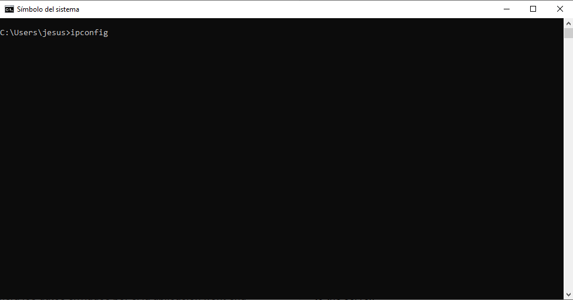
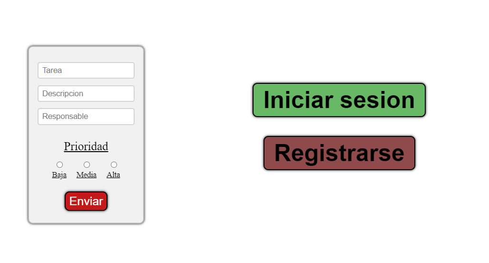
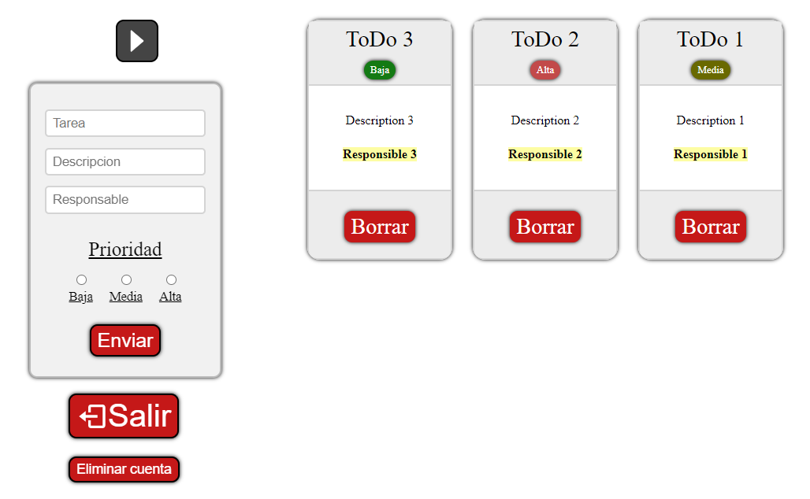

# Getting Started with this To-Do App!

- [Introduction](#introduction).
- [First steps](#first-steps).
- [Running the server localServer](#running-the-server-localserver)
- [Running the server localServerMongoDB](#running-the-server-localservermongodb)
- [Running the app](#running-the-app).


## Introduction

The application is a ToDoList 📝 made in ReactJS for the Frontend and NodeJS with express for the Backend, for this reason the project is divided into two different folders, for each section. 

There are two different Backends

1.  localServer - It manages the information using in a single file, so reading is done by observing the saved data, and writing by overwriting the file
2.  localServerMongoDB - It manages the information using a No-SQL database created with MongoDB, so it is necessary to have this database system installed.

The project has different functionalities so it is quite complete for an initial project 


##  First steps

Once the folder has been downloaded, proceed to access to the folders and install all the corresponding libraries and dependencies in each of the folders separately since in theory they are different projects using ```npm install```


##  Running the server *localServer*

Once the libraries and dependencies are installed, proceed to go to the "localServer" folder, to start the server.💻

Once there, proceed to start the server with using ```node index.js```, or in case you have the nodemon library installed, you can then use ```nodemon index.js```. But that last one is in case you want to make changes to the file, so they will update immediately
 
And finally the server tasks will be active!! 🥳🥳


##  Running the server *localServerMongoDB*

Once the folder is installed, proceed to go to the "command prompt" and start the MongoDB database using the command ```mongod```

Once the the database is running and the libraries and dependencies are installed, proceed to go to the "localServerMongoDB" folder, to start the server.💻

Start the server using ```node index.js```, or in case you have the nodemon library installed, you can then use ```nodemon index.js```. But that last one is in case you want to make changes to the file, so they will update immediately
 
And finally the server tasks will be active!! 🥳🥳


##  Running the app

### Initial configuration

Since the To-Do-List will connect to the created server, it is necessary to know its IP address, in order to know where the information is going to be sent. By default it is on port 3000, but you need to know the IP address. 🔍

Therefore you have to go to the command prompt of the computer where the server is running and type ipconfig as shown below



There you can see the IP of the machine which usually starts with 192.168

Once you have the IP of the machine where the server is, you should go to "toDoList/src/componentes/AplicaciónTareas.jsx", and change ```const ipServer = 'http://192.168.1.101:3000' ``` by the ip that you previously searched for. 📢📢 Don't forget to put ":3000" at the end of the ip address, which matches the server port

This way the data sent by the front-end application will go directly to the server. 🥳🥳


### Starting the App

Now we proceed to start the front-end server ```npm start ```, obtaining the following 💻



The operation of the application is quite intuitive, allowing you to register new users and access previously registered user accounts. 📝



By default there will be no user registered when running the project for the first time, so it is necessary that you create the first user to later add the tasks

The application is quite complete since it has different functionalities, in addition to the fact that many bugs that the project initially had were corrected. ✅


